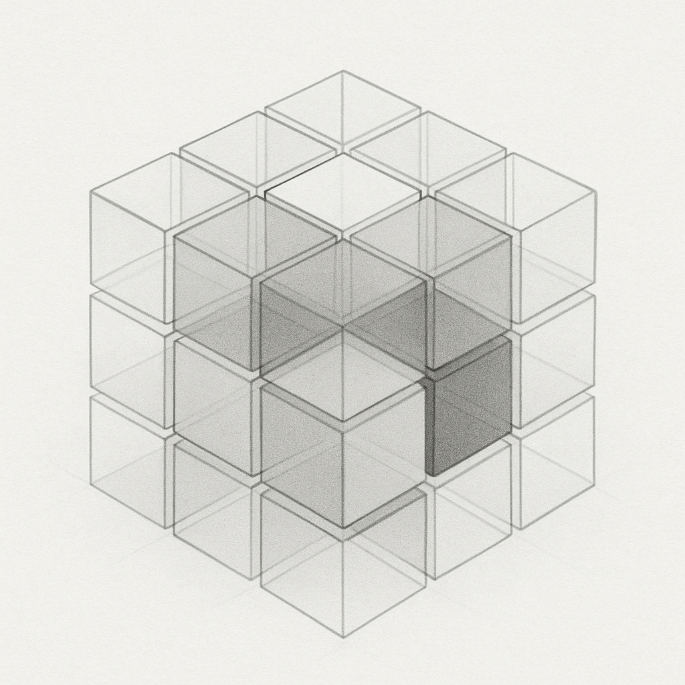
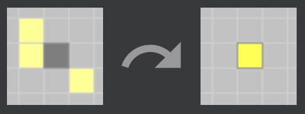
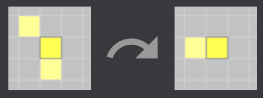
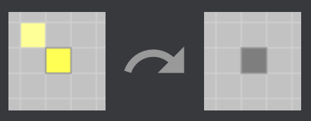
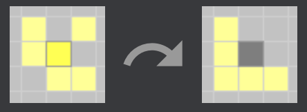
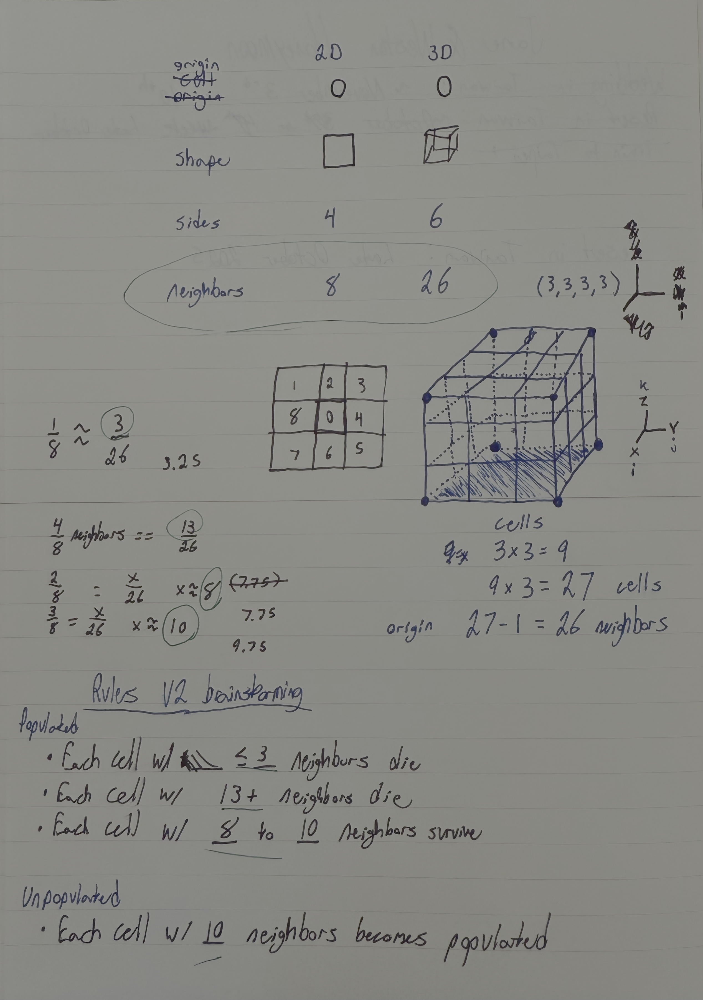

<p align="center">
  <a href="www.google.com">
    
  </a>
</p>

<h3 align="center">Game of Life 3D</h3>

<div align="center">

| | |
|----------------------|--------------------------|
| **Creator:** | [Weston Mauz](https://github.com/wmauz677) |
| **Company:** | Morpheus Tech LLC |
| **Project Start:** | October 7th, 2023 |

</div>

### Project Index:

1. [Mission Statement](#1-mission-statement)
2. [Rules](#2-rules)
3. [Design Methodology](#3-design-methodology)
4. [Status](#4-status)
5. [Next Steps](#5-next-steps)
6. [Run Locally](#6-run-locally)
7. [License](#7-license)
8. [Attributions](#8-attributions)

## 1. Mission Statement

The goal of this project is to explore modern computer graphics by re-imagining [Conway's Game of Life](https://en.wikipedia.org/wiki/Conway%27s_Game_of_Life) in 3-Dimensions.

## 2. Rules

The original 2D rules are shown next to the new, reimagined 3D rules that are used in this project.

| Rule                        | Description                                                                                | 2D (Conway’s) | Visualization [1] | 3D |
| ---------------------------- | ------------------------------------------------------------------------------------------ | -------------- | ---------------- | --- |
| **Birth**                   | If a cell has exactly ***x*** living neighbors and is<br>initially dead, it becomes alive. | 3              |  | 9, 10 |
| **Survival**                | If a cell has ***[x,y,z]*** living neighbors, it<br>stays alive in the next generation.    | 2, 3           |  | 5–15 |
| **Death by Isolation**      | If a cell has fewer than ***x*** living<br>neighbors, it dies (becomes dead).              | 2              |  | 5 |
| **Death by Overcrowding**   | If a cell has more than ***x*** living neighbors, it dies.                                 | 3              |  | 11 |


### State Transition Table

| Current State | Conway’s Life – Living Neighbors | 3D Life – Living Neighbors | Next State | Rule Triggered / Reason       |
|---------------|----------------------------------|----------------------------|------------|-------------------------------|
| `1` (Alive)   | 0 – 1                            | 0 – 4                      | `0`        | **Dies** — underpopulation    |
| `1` (Alive)   | **2 – 3**                        | **5 – 15**                 | `1`        | **Survives / Lives**          |
| `1` (Alive)   | 4 – 8                            | 16 – 26                    | `0`        | **Dies** — overcrowding       |
| `0` (Dead)    | 0 – 2                            | 0 – 8                      | `0`        | Not enough neighbors / no birth |
| `0` (Dead)    | **3**                            | **9 – 10**                 | `1`        | **Birth / Reproduction**      |
| `0` (Dead)    | 4 – 8                            | 12 – 26                    | `0`        | Overcrowded — no birth        |

## 3. Design Methodology

### Tools
This project was built with vanilla javascript with the addition of the [three.js](https://threejs.org) library. [Cursor](https://cursor.com), [ChatGPT](https://chatgpt.com), & [Claude](https://claude.ai/) were used to assist with writing code, researching mathematical concepts, & brainstorming different ideas. This was programmed on an M4 [Mac Mini](https://www.apple.com/mac-mini/) & M1 [Macbook Air](https://www.apple.com/shop/buy-mac/macbook-air) using MacOS. The development past initial publish will be done on custom hardware running [Omarchy](https://omarchy.org).

### Resources
Much of the inspiration for the design for this project was from [3Blue1Brown](https://www.youtube.com/@3blue1brown), specifically the course [Essence of linear algebra](https://www.youtube.com/watch?v=fNk_zzaMoSs&list=PLZHQObOWTQDPD3MizzM2xVFitgF8hE_ab). Further inspiration came from the [Lex Friedman Podcast](https://lexfridman.com/podcast/), specifically conversations with [Stephen Wolfram](https://www.youtube.com/watch?v=ez773teNFYA) & [Neil Gershenfeld](https://www.youtube.com/watch?v=YDjOS0VHEr4). Two Game of Life websites also helped formulate the UI, such as [Play Game of Life](https://playgameoflife.com) & [Conway Life](https://conwaylife.com). Finally, an interview of Conway himself, by [Numberphile](https://www.youtube.com/watch?v=R9Plq-D1gEk).

### Process
The original idea began on pen-and-paper, starting with a 3D drawing representing a 3D cube made of cubes (see company logo). The 3D model was determined to be best represented mathematically by a three dimensional matrix, as linear algebra can be leveraged for computational efficiency. The idea was then delivered to various LLM to build a prototype of the software in Python. That prototype, was then reviewed & re-written line-by-line by a human software engineer. That version was then translated to javascript by an LLM, then passed back to the human engineer to be re-written manually, again. There were many iterations & refactors performed by handing off between LLM & human engineer. The end goal of this process was to deliver software that was clearly human readable & followed software development best practices.

<p align="center">
  
</p>

## 4. Status

### Current State
The project is currently building a 50x50x50 matrix & calculating 100 generations of the game of life 3D. The starting seed is a "living" cube in the center of this matrix with side length 10, where 100% of the cells in that space are alive.

### Intended Final State
The original goal was to have a 100x100x100 simulation (1 million cells), which proved to be a challenge, as the hardware used to create this project hit >100% CPU utilization when running under those conditions.

## 5. Next Steps
There are four major features that need to be added in order to get the software to match the original vision. 

### Need-to-have features

| # | Feature | Description |
|---|----------|-------------|
| 1 | **Rules Modification** | User can modify the rules of the game and regenerate the simulation. |
| 2 | **Seed Generation** | User can select from a given list of starting seeds and configure them based on size and density. |
| 3 | **Size & Generations** | User can modify the size of the simulation & number of generations to simulate. Ideally there will be some loading bar, as anything past the current state will likely require the user to wait |
| 4 | **Clock Visualization** | Implement a graphical clock tied directly to the simulation. |

### Nice-to-have feature

| # | Feature | Description |
|---|----------|-------------|
| 1 | **Upload Starting Seed** | User can upload a starting seed -- likely some csv of a matrix or some 3D file type converted to matrix format |

## 6. Run Locally

1. Clone the repository
2. ```npm install```
3. ```npm run build```
4. ```npm run dev```


## 7. License

Distributed under the MIT License. See `LICENSE` for more information.

[language-shield]: https://img.shields.io/github/languages/top/wmauz677/MarchMadness2023?style=for-the-badge
[license-shield]: https://img.shields.io/github/license/wmauz677/marchmadness2023?style=for-the-badge
[license-url]: https://github.com/wmauz677/personalWeb/blob/gh-pages/LICENSE

## 8. Attributions

[1] Conway's Game of Life Rules -- 2D Visualization: https://playgameoflife.com/info